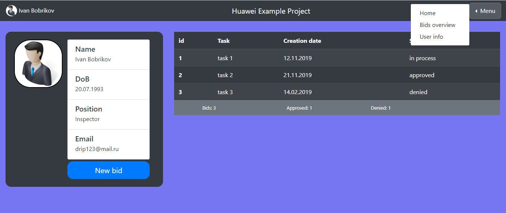
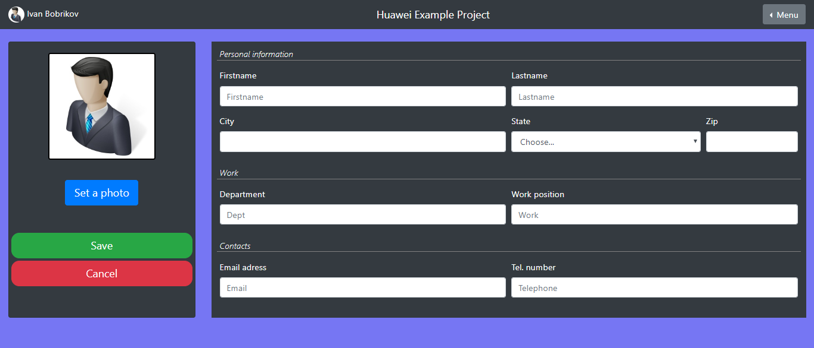

##BidApp
This is demo app. It has a user and manager interfaces with own login and password for each.
User could create a bid and check a status of it. 
After bid creation user could get email about his bid (the bid was created, sended to manager and what status it has)
Manager could see a list of bids and deny or approve it. When manager clicked on approve/deny button, 
status of bid changing to approved/denied and user that create that bid receive email with updated status.

Microservices interaction scheme: 

Login as a user or a manager according to a role stored in DB: 

Home page:

Creating a new bid in modal window:

Manager can approve or deny the bid and then the user will get an email message:

Information about employee:

Edit information of employee page: 

